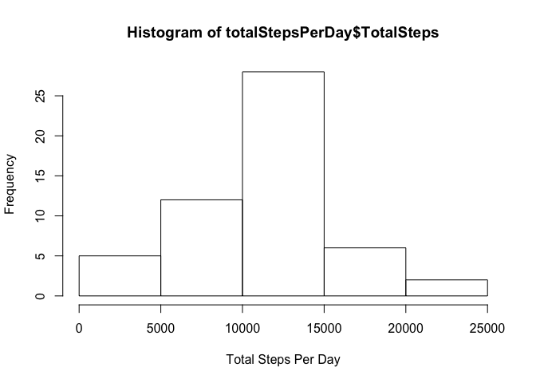
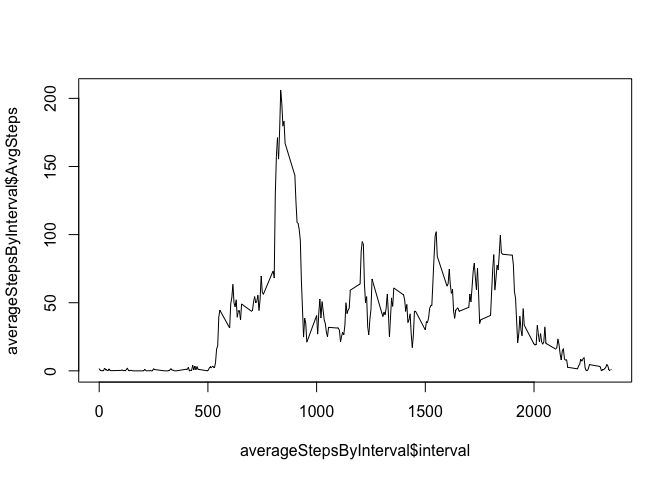
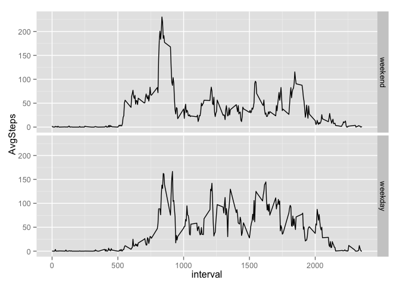

# Reproducible Research: Peer Assessment 1


## Loading and preprocessing the data

```r
library(dplyr)
```

```
## 
## Attaching package: 'dplyr'
## 
## The following object is masked from 'package:stats':
## 
##     filter
## 
## The following objects are masked from 'package:base':
## 
##     intersect, setdiff, setequal, union
```

```r
library(ggplot2)
```

```
## Warning: package 'ggplot2' was built under R version 3.1.3
```

```r
rawData <- read.csv("activity.csv",header=TRUE, colClasses=c("integer","Date","integer"))
## activityWithoutNAs <- filter(rawData, !is.na(steps))
```

## What is mean total number of steps taken per day


```r
activityWithoutNAs <- filter(rawData, !is.na(steps))

totalStepsPerDay <- summarize(dplyr::group_by(activityWithoutNAs,date), TotalSteps = sum(steps))

hist(totalStepsPerDay$TotalSteps,xlab = "Total Steps Per Day" )
```

 

```r
dailyTotals <- totalStepsPerDay$TotalSteps

mean(dailyTotals)
```

```
## [1] 10766.19
```

```r
median(dailyTotals)
```

```
## [1] 10765
```
## What is the average daily activity pattern?

```r
averageStepsByInterval <- summarize(group_by(activityWithoutNAs,interval), AvgSteps = mean(steps))

plot(averageStepsByInterval$interval,averageStepsByInterval$AvgSteps, type="l")
```

 

```r
InervalWithMaxAvgSteps = arrange(averageStepsByInterval, desc(AvgSteps))[1,1]
```


## Imputing missing values
## I will use the average steps for the 5 minute interval to fill NAs

```r
TotalNAValues = sum(is.na(rawData$steps))
index <- 1: dim(rawData)[1]
rawData2 <- cbind(index,rawData)
for(x in rawData2$index)
{
    if(is.na(rawData2[x,2]))
    {
        row <- filter(averageStepsByInterval, interval == rawData2[x,4])
        rawData2[x,2] = row$AvgSteps
    }  
}

totalStepsPerDay2 <- summarize(group_by(rawData2,date), TotalStepsPerDay= sum(steps))

hist(totalStepsPerDay2$TotalStepsPerDay)
```

 

```r
mean(totalStepsPerDay2$TotalStepsPerDay)
```

```
## [1] 10766.19
```

```r
median(totalStepsPerDay2$TotalStepsPerDay)
```

```
## [1] 10766.19
```
## Are there differences in activity patterns between weekdays and weekends?

```r
rawData2 <- mutate(rawData2, WeekDayName = weekdays(date))
rawData2 <- mutate(rawData2, WeekDayType = rawData2$WeekDayName %in% c("Saturday","Sunday"))
rawData2 <- mutate(rawData2, WeekDayType = factor(WeekDayType, levels = c(FALSE,TRUE), labels = c("weekend","weekday")))
averageStepsByInterval2 <- summarize(group_by(rawData2,interval,WeekDayType), AvgSteps = mean(steps))
ggplot(averageStepsByInterval2, aes(interval,AvgSteps)) + geom_line() +  facet_grid(WeekDayType~.)
```

 
